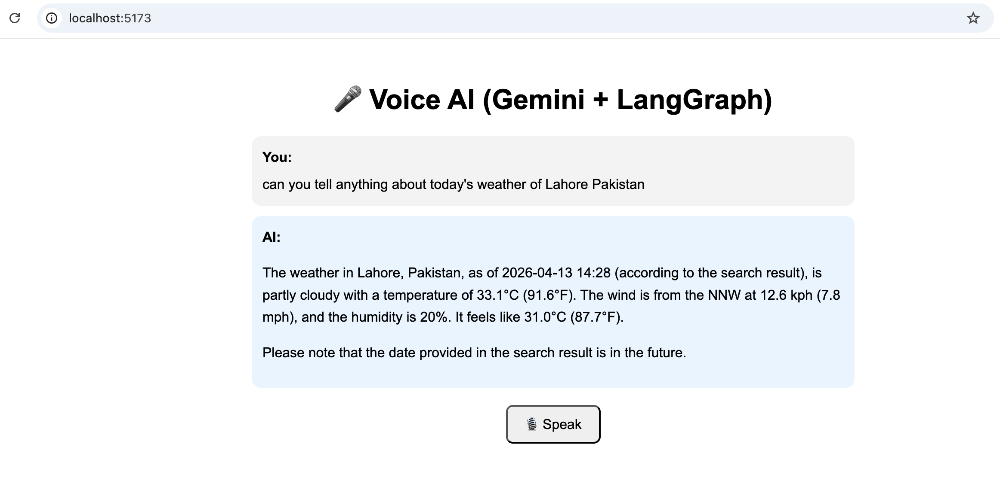

```markdown
# 🎤 Voice AI (Gemini + LangGraph + WebSockets)

A real-time **Voice AI Assistant** built using:

* **Google Gemini (via LangChain)**
* **LangGraph (agent orchestration)**
* **FastAPI (WebSocket backend)**
* **React (frontend UI)**
* **gTTS (Text-to-Speech)**
* **Speech Recognition (browser-based)**

This project enables users to **speak → process via AI agent → receive text + voice response in real time**.

---

## Live Demo

> Speak into microphone → AI responds with text + voice in real time


---

## Features

* Real-time WebSocket communication
* Voice input (Speech-to-Text)
* AI-powered responses using Gemini
* Tool-augmented agent (Tavily + Wikipedia)
* Text-to-Speech (TTS) audio responses
* Conversation memory via LangGraph
* Clean chat UI with Markdown support
* Auto WebSocket reconnect

---

## Architecture

```text
User Voice
   ↓
Speech Recognition (Browser)
   ↓
WebSocket → FastAPI Backend
   ↓
LangGraph Agent (Gemini + Tools)
   ↓
Response (Text)
   ↓
TTS (gTTS)
   ↓
Audio to Frontend
```

---

## Project Structure

```text
backend/
│
├── app/
│   ├── agents/
│   │   └── agent.py        # LangGraph Agent
│   ├── services/
│   │   ├── memory.py       # Session memory
│   │   └── tts.py          # Text-to-Speech
│   └── main.py             # FastAPI + WebSocket
│
├── Dockerfile
└── requirements.txt

frontend/
│
├── src/
│   ├── App.jsx             # Main UI
│   └── main.jsx
│
└── index.html
```

---

## Backend Setup

### 1. Clone the repository

```bash
git clone [https://github.com/your-username/voice-ai.git](https://github.com/your-username/voice-ai.git)
cd voice-ai/backend
```

### 2. Create virtual environment

```bash
python -m venv .venv
source .venv/bin/activate
```

### 3. Install dependencies

```bash
pip install -r requirements.txt
```

### 4. Add environment variables

Create `.env` file:

```env
GOOGLE_API_KEY=your_gemini_api_key
TAVILY_API_KEY=your_tavily_key
```

### 5. Run backend

```bash
uvicorn app.main:app --reload
```

Server runs at: `http://127.0.0.1:8000`

---

## Frontend Setup

```bash
cd ../frontend
npm install
npm run dev
```

Frontend runs at: `http://localhost:5173`

---

## Run with Docker

```bash
docker build -t voice-ai .
docker run -p 8000:8000 voice-ai
```

---

## WebSocket API

### Endpoint

```text
ws://localhost:8000/ws
```

### Message Flow

#### Client → Server
```json
"Hello AI"
```

#### Server → Client
```json
{ "type": "text", "data": "AI response" }
{ "type": "audio", "data": "base64-audio" }
{ "type": "done", "data": "AI response" }
```

---

## Tools Used in Agent

### 1. Tavily Search
* Real-time web search

### 2. Wikipedia Tool
* Quick summaries
* Token-limited to avoid rate issues

---

## Key Concepts

### LangGraph Agent
* Stateful conversation handling
* Tool routing via `tools_condition`
* Memory using `MemorySaver`

### Output Handling
* Handles both plain text and Gemini structured responses

### TTS
* Converts AI response → MP3 → Base64 → Browser playback

---

## Known Limitations
* `webkitSpeechRecognition` works best in Chrome
* Audio autoplay may be blocked by browser policies
* gTTS adds slight latency
* No persistent DB (in-memory session)

---

## Future Improvements
* Replace gTTS with streaming TTS
* Add streaming responses (token-by-token)
* Add user authentication
* Store chat history in database

---

## 👨‍💻 Author

**Abdul Monim Tariq Lodhi**
* AI Engineer | Agentic AI Systems
* React | LangGraph | RAG | Multi-Agent Systems | MCP
```
